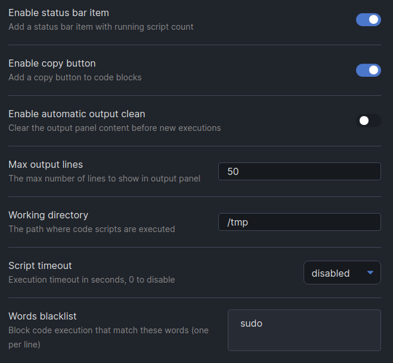

# Obsidian Commander Plugin

This [Obsidian.md](https://obsidian.md/) plugin allow to evaluate Sh, Bash, JavaScript, Python, PHP and GO code blocks.

## Requirements

For every languages you want to support you need the corresponding runtime installed locally (php, nodejs, python, go..).

## Installation

Download zip archive from [GitHub releases page](https://github.com/daaru00/obsidian-commander/releases) and extract it into `<vault>/.obsidian/plugins` directory.

## Usage

When a run button in code block is pressed the plugin will create a script file into temporary directory (`/tmp` by default) and execute it using configured executable path.

Use the "Show console output" command to open a panel that show output and error.


The plugin use script template configuration to setup the running environment, 
for example for JavaScript the default template is:
```
(async () => {
  %CONTENT%
})()
```

Plugin can handle parallels scripts executions:


## Configurations

General configurations allow to enable/disable the copy button, configure output panel behavior and configure the temporary script directory.



Also environment variables can be configured:


Each supported languages has a configurations section that allow you to configure the executable path and the script file template. Use the `%CONTENT%` keyword as a placeholder of code block content that will be executed.


