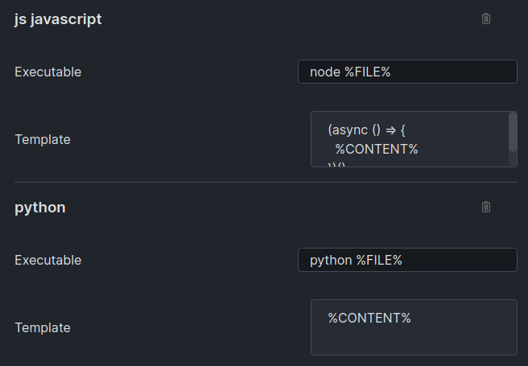

# Obsidian Commander Plugin

This [Obsidian.md](https://obsidian.md/) plugin allow to evaluate Sh, Bash, JavaScript, Python and GO code block.


## Features

- Evaluate code block
- Copy code block
- See code output
- Copy code output

When a run button in code block is pressed the plugin will create a script file into temporary directory (`/tmp` by default) and execute it using configured executable path. Output and error will be showed up in a custom view panel.


The plugin use script template configuration to setup the running environment, 
for example for JavaScript the default template is:
```
(async () => {
  %CONTENT%
})()
```

This allow you to execute code with Promise support:


## Installation

Download zip archive from [GitHub releases page](https://github.com/daaru00/obsidian-commander/releases) and extract it into `<vault>/.obsidian/plugins` directory.

## Configurations

General configurations allow to enable/disable the copy button, configure output panel behavior and configure the temporary script directory.


Each supported languages has a configurations section that allow you to configure the executable path and the script file template. Use the `%CONTENT%` keyword as a placeholder of code block content that will be executed.


